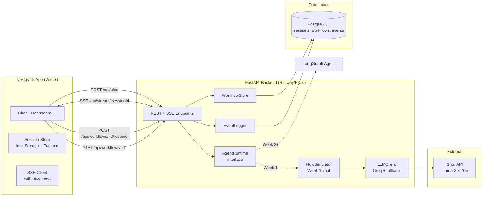
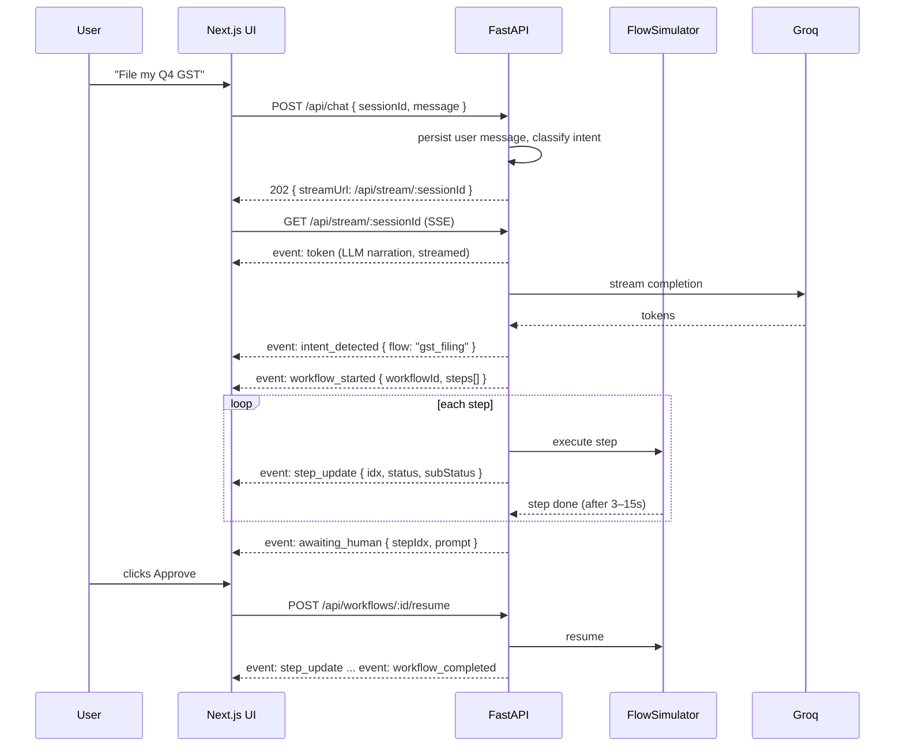

# Design Document

## Overview

This document describes the technical design for the DigiNav AI Week 1 MVP: a demo-ready chat + live workflow dashboard that streams LLM responses from Groq (Llama-3.3-70b) and simulates three regulatory flows (Company Incorporation, GST Filing, Shops & Establishment License) with realistic timing and narration.

### Design Philosophy

Three principles drive every decision in this design:

1. **Real front, simulated back.** The LLM is real. The conversational UX is real. The workflow engine is a deterministic simulator that *looks and feels* like the future LangGraph agent. Every interface the frontend sees (streaming events, state API, approval flow) is shaped to match what LangGraph will emit, so Week 2 is a backend-internal swap.

2. **One seam per future capability.** The architecture leaves a single, named integration point for each upcoming piece: `AgentRuntime` (→ LangGraph), `DPIGateway` (→ Aadhaar/GSTN/DigiLocker/Playwright), `RegulatoryMemory` (→ Pinecone + PostgreSQL), `RiskScorer` (→ predictive model). In Week 1, each is a stub. In later weeks, each is replaced without touching callers.

3. **Demo-first, production-clean.** The app must survive a live pilot demo on a shaky hotel WiFi. That means SSE with reconnect, server-side workflow state, scripted fallback if Groq is down, and skeleton loading everywhere. These are not polish items. They are core.

### Scope Reminder

- **In:** Next.js 15 chat UI, FastAPI backend, Groq streaming, workflow simulator for 3 flows, compliance health snapshot, admin analytics, session persistence.
- **Out:** real DPI APIs, Playwright, payments, multi-tenant auth, LangGraph, Pinecone, predictive risk model, mobile push, voice/vision input.

## Architecture

### High-Level System Diagram



### Request & Stream Lifecycle



### Why Two HTTP Calls (POST then SSE)

POST /api/chat does server-side classification and session write, then returns a short-lived stream URL. The SSE GET is separate so:

- Browser reconnects on drop hit an idempotent GET, not a repost.
- The stream survives page refresh using the same `sessionId`.
- SSE is simpler than bidirectional WebSocket and Vercel/Railway-friendly. Socket.IO is deferred until we need server push to idle clients (Week 3 dashboard alerts).

## Components and Interfaces

### Frontend Components (Next.js 15 App Router)

Directory layout:

```
app/
  layout.tsx
  page.tsx                     # Main split-view (chat + dashboard)
  admin/page.tsx               # Protected analytics page
  api/                         # (empty — backend is FastAPI)
components/
  chat/
    ChatPanel.tsx              # Message list + input
    MessageBubble.tsx
    SuggestedPrompts.tsx
    TypingIndicator.tsx
  dashboard/
    WorkflowDashboard.tsx      # Right pane wrapper
    WorkflowCard.tsx           # Header with progress + ETA
    StepCard.tsx               # One step, 4 visual states
    HumanApprovalGate.tsx      # Approve/Reject block
    ComplianceHealthCard.tsx
    HealthSubIndicator.tsx
  shared/
    ReconnectBanner.tsx
    SkeletonChat.tsx
    SkeletonDashboard.tsx
lib/
  api.ts                       # fetch wrappers
  sse.ts                       # SSE client with reconnect + backoff
  store.ts                     # Zustand store (chat, workflows, session)
  persistence.ts               # localStorage hydrate/dehydrate
  intents.ts                   # client-side intent hints (optional)
  types.ts                     # shared TS types mirroring backend events
```

**State management:** Zustand (single store with slices). Rationale: simpler than Redux, better for SSE-driven partial updates than React Context, and Zustand's `persist` middleware gives us free localStorage hydration for Req 1.6 and Req 7.1.

**Streaming transport on the client:** `EventSource` is insufficient because it doesn't allow POST bodies and headers cleanly. We use `fetch` with `ReadableStream` and a small parser in `lib/sse.ts`. Reconnect uses exponential backoff (1s, 2s, 4s, 8s, 16s, 30s cap) per Req 7.2.

**Input behavior (Req 1.7):** `ChatPanel` input captures `onKeyDown`. Enter without Shift calls `handleSend()`. Shift+Enter inserts a newline via default textarea behavior. The input is a `<textarea>` with auto-resize, not an `<input>`, to support multi-line messages.

**Responsive layout strategy (Req 6.2):** The main `page.tsx` uses a CSS Grid with `grid-template-columns: 1fr 1fr` on desktop (≥1024px). On tablet (768–1023px), the dashboard collapses into a bottom sheet / tab below the chat. On mobile (<768px), the layout is fully stacked with a toggle button to switch between chat and dashboard views. Tailwind responsive prefixes (`lg:`, `md:`) drive all breakpoint logic — no JS-based media queries.

**Interaction feedback (Req 6.3):** All interactive elements use shadcn/ui's built-in focus-visible ring and hover states. Custom components (StepCard, HumanApprovalGate) add Tailwind `transition-all duration-150` for sub-200ms feedback. Focus states use `ring-2 ring-primary/50` for visibility without relying on color alone.

### Backend Components (FastAPI)

Directory layout:

```
backend/
  app/
    main.py                    # FastAPI app, CORS, routers
    config.py                  # pydantic Settings
    routers/
      chat.py                  # POST /api/chat, GET /api/stream/:sid
      workflows.py             # GET, resume
      admin.py                 # /admin analytics
    core/
      agent_runtime.py         # AgentRuntime interface (seam)
      flow_simulator.py        # Week 1 impl of AgentRuntime
      flows/
        incorporation.py       # 8-step scripted flow
        gst_filing.py          # 6-step scripted flow
        se_license.py          # 5-step scripted flow
      llm_client.py            # Groq streaming + fallback
      intent_classifier.py     # LLM-based classify into 3 flows
      events.py                # typed event dataclasses
    store/
      workflow_store.py        # WorkflowStore (PG-backed)
      event_logger.py
      db.py                    # SQLAlchemy async session
    models/
      session.py
      workflow.py
      event.py
  alembic/                     # migrations
  tests/
  pyproject.toml
```

### Core Interface: `AgentRuntime`

This is the single seam that future LangGraph implementation plugs into.

```python
# core/agent_runtime.py
from typing import AsyncIterator, Protocol
from .events import AgentEvent

class AgentRuntime(Protocol):
    async def start(
        self, session_id: str, user_message: str
    ) -> AsyncIterator[AgentEvent]: ...

    async def resume(
        self, workflow_id: str, approval: bool
    ) -> AsyncIterator[AgentEvent]: ...

    async def get_state(self, workflow_id: str) -> "WorkflowSnapshot": ...
```

Week 1: `FlowSimulator` implements this. Week 2: `LangGraphAgent` implements this. The routers depend only on the Protocol.

### Flow Simulator Design

Each flow is a declarative list of steps. The simulator walks the list, calls the LLM for narration, waits a randomized duration (3–15s per Req 3.4), and emits events.

```python
# core/flows/incorporation.py
INCORPORATION_FLOW = [
    Step(id="name_reserve", title="Reserve company name (RUN)",
         duration_range=(4, 8), narration_prompt="..."),
    Step(id="din_apply",    title="Apply for DIN", duration_range=(5, 10), ...),
    Step(id="dsc_issue",    title="Issue Digital Signature Certificate", ...),
    Step(id="moa_aoa",      title="Draft MoA and AoA", ...),
    Step(id="spice_b",      title="Submit SPICe+ Part B", ...),
    Step(id="human_review", title="Review and approve submission",
         requires_human=True),
    Step(id="pan_tan",      title="Allot PAN and TAN", ...),
    Step(id="cin_gen",      title="Generate CIN", ...,
         final_output_template="CIN: U72900MH2026PTC{rand:06}"),
]
```

The simulator is deliberately data-driven so adding more flows later is configuration, not code.

### LLM Client with Fallback

```python
# core/llm_client.py
class LLMClient:
    async def stream_narration(self, prompt: str) -> AsyncIterator[str]:
        for attempt in range(3):
            try:
                async for tok in self._groq_stream(prompt):
                    yield tok
                return
            except (TimeoutError, GroqError) as e:
                await asyncio.sleep(2 ** attempt)
        # fallback per Req 7.4
        async for tok in self._scripted_fallback(prompt):
            yield tok
```

Scripted fallback is a per-flow, per-step canned narration dict. Ensures demo resilience when Groq is down.

### Event Schema (Frontend ↔ Backend Contract)

All SSE events use this discriminated union. This is the contract LangGraph must honor in Week 2.

```typescript
// lib/types.ts (mirrored in Python via pydantic)
type AgentEvent =
  | { type: "token"; text: string; messageId: string }
  | { type: "intent_detected"; flow: FlowId; confidence: number }
  | { type: "workflow_started"; workflowId: string; steps: StepSummary[] }
  | { type: "step_update"; workflowId: string; stepIdx: number;
      status: "pending" | "in_progress" | "completed" | "blocked_awaiting_human";
      subStatus?: string }
  | { type: "awaiting_human"; workflowId: string; stepIdx: number; prompt: string }
  | { type: "workflow_completed"; workflowId: string; output: Record<string, unknown> }
  | { type: "error"; message: string; correlationId: string; recoverable: boolean };
```

### API Endpoints

| Method | Path                                  | Purpose                                     |
|--------|---------------------------------------|---------------------------------------------|
| POST   | `/api/chat`                           | Accept user message, return stream URL      |
| GET    | `/api/stream/{sessionId}`             | SSE stream of `AgentEvent`s                 |
| GET    | `/api/workflows/{workflowId}`         | Fetch full workflow snapshot (rehydrate)    |
| POST   | `/api/workflows/{workflowId}/resume`  | Approve or reject a blocked step            |
| POST   | `/api/health-check`                   | Compute compliance health snapshot          |
| GET    | `/api/admin/stats`                    | Aggregated counts for /admin (secret-gated) |
| GET    | `/api/admin/events`                   | Last 50 events for /admin                   |

### Mid-Flow Clarifying Questions (Req 3.6)

The architecture supports concurrent chat and workflow execution because the `FlowSimulator` runs as a background `asyncio.Task` independent of the chat request path. When a user sends a message mid-flow:

1. `POST /api/chat` classifies the intent. If it's `general_chat` (not a new flow trigger), the backend streams an LLM response via `token` events on the same SSE channel.
2. The running `FlowSimulator` task continues emitting `step_update` events in parallel.
3. The frontend interleaves `token` events (appended to chat) and `step_update` events (updating dashboard) from the same SSE stream — they are distinguished by the `type` field.

This means the user can ask "What is DIN?" while the incorporation flow is running, get an LLM answer in chat, and see the dashboard continue progressing without interruption.

### Quick Demo Mode (Req 7.3)

The welcome screen includes a "Try a sample flow" button. When clicked:

1. Frontend calls `POST /api/chat` with a synthetic message (`"__demo_incorporation__"`) and a fresh session ID.
2. The backend detects the demo flag and starts the `FlowSimulator` with `use_scripted_only=True` — no Groq calls, purely canned narration tokens.
3. Step durations are compressed (1–3s per step instead of 3–15s) so the full Incorporation flow completes in under 60 seconds.
4. The SSE stream emits the same event types as a real flow, so the frontend renders identically.

This ensures the demo works even with no network, no Groq key, and no database (in-memory fallback for demo mode).

### Downloadable Dummy PDF (Req 2.7)

When a workflow completes, the `workflow_completed` event includes an `output` object with the generated identifier (CIN, ARN, license number). The frontend renders a success summary card with:

- The output data displayed prominently.
- A "Download Certificate" button that generates a client-side PDF using a lightweight library (`@react-pdf/renderer` or `jsPDF`). The PDF contains: DigiNav branding, the flow name, completion timestamp, and the simulated output identifier.

No server-side PDF generation is needed for the MVP — the certificate is cosmetic and generated entirely in the browser.

### Compliance Health Interaction Design (Req 4.3, 4.4)

The `ComplianceHealthCard` component has two states:

**State A — No profile (Req 4.4):** Displays a soft prompt card with copy: "Run a 2-minute compliance scan to see where your business stands. No data is submitted to any government portal." A "Start Scan" button opens a minimal form (name, type, state, founding date) inline or as a modal. Privacy copy is always visible.

**State B — Profile entered (Req 4.1, 4.2, 4.3):** Displays the overall score (0–100) with a circular progress indicator. Below it, four `HealthSubIndicator` rows, each showing:
- Area name (Incorporation, GST, Labor, Annual Filings)
- Colored badge (green ≥80, amber 50–79, red <50) plus a text label ("Good", "Needs attention", "At risk") so color is not the sole indicator (Req 6.5)
- One-line explanation

On click, each sub-indicator expands (animated with Framer Motion) to show:
- Specific items driving the score (e.g., "No CIN on file", "Last GST filing was 8 months ago")
- A "Start this flow" CTA button that triggers the corresponding workflow via the chat interface

### Admin Page

`/admin` uses a single shared secret passed via header `X-Admin-Token` stored in an environment variable. Sufficient for MVP; replaced with proper auth in later specs.

## Data Models

### PostgreSQL Schema (SQLAlchemy async, Alembic migrations)

```sql
-- sessions: browser sessions, not auth
CREATE TABLE sessions (
  id UUID PRIMARY KEY,
  created_at TIMESTAMPTZ NOT NULL DEFAULT now(),
  last_seen_at TIMESTAMPTZ NOT NULL DEFAULT now(),
  business_profile JSONB  -- name, state, type, founded_at (optional)
);

-- chat_messages
CREATE TABLE chat_messages (
  id UUID PRIMARY KEY,
  session_id UUID NOT NULL REFERENCES sessions(id),
  role TEXT NOT NULL CHECK (role IN ('user','assistant','system')),
  content TEXT NOT NULL,
  created_at TIMESTAMPTZ NOT NULL DEFAULT now()
);
CREATE INDEX idx_chat_session_time ON chat_messages(session_id, created_at);

-- workflows
CREATE TABLE workflows (
  id UUID PRIMARY KEY,
  session_id UUID NOT NULL REFERENCES sessions(id),
  flow_id TEXT NOT NULL,  -- 'incorporation' | 'gst_filing' | 'se_license'
  status TEXT NOT NULL,   -- running | awaiting_human | completed | failed
  current_step_idx INT NOT NULL DEFAULT 0,
  steps JSONB NOT NULL,   -- full denormalized step list with states
  output JSONB,
  started_at TIMESTAMPTZ NOT NULL DEFAULT now(),
  updated_at TIMESTAMPTZ NOT NULL DEFAULT now(),
  completed_at TIMESTAMPTZ
);
CREATE INDEX idx_workflows_session ON workflows(session_id);

-- events: analytics only, no PII (Req 8.4)
CREATE TABLE events (
  id BIGSERIAL PRIMARY KEY,
  session_id UUID NOT NULL,
  event_type TEXT NOT NULL,   -- message_sent | workflow_started | workflow_completed | workflow_failed | approval_granted
  flow_id TEXT,
  prompt_hash TEXT,           -- SHA256 of normalized prompt
  duration_ms INT,
  metadata JSONB,
  created_at TIMESTAMPTZ NOT NULL DEFAULT now()
);
CREATE INDEX idx_events_time ON events(created_at DESC);
```

### Workflow JSONB Shape

```json
{
  "steps": [
    { "idx": 0, "id": "name_reserve", "title": "Reserve company name",
      "status": "completed", "subStatus": null, "startedAt": "...", "endedAt": "..." },
    { "idx": 1, "id": "din_apply", "title": "Apply for DIN",
      "status": "in_progress", "subStatus": "Validating director details..." }
  ]
}
```

Storing the full step list in JSONB (vs normalized) is intentional: steps are tightly coupled to the parent workflow, we never query across steps, and JSONB makes state-restore on refresh a single row read (Req 7.1).

### Compliance Health Computation

Rule-based in MVP. No ML. Inputs: `business_profile` fields; outputs: 4 sub-scores + weighted total.

```python
def compute_health(profile: BusinessProfile) -> HealthReport:
    incorp = 100 if profile.cin else 40
    gst    = 100 if profile.gstin else (70 if profile.turnover_under_threshold else 20)
    labor  = 80  if profile.se_license else 50
    annual = 90  if profile.last_filing_within_year else 30
    overall = round(0.3*incorp + 0.3*gst + 0.2*labor + 0.2*annual)
    return HealthReport(overall=overall, subs={...})
```

The `HealthScorer` interface leaves room for the predictive model in later weeks.

## Error Handling

### Error Taxonomy

| Class              | Example                     | UX                                            | Recovery                        |
|--------------------|-----------------------------|-----------------------------------------------|---------------------------------|
| Transient network  | SSE disconnect              | "Reconnecting…" banner, auto-retry             | Exponential backoff (Req 7.2)   |
| LLM provider error | Groq 5xx / timeout          | Silent retry ×2, then fallback narration       | `LLMClient` retry + fallback    |
| Flow logic error   | Unknown flow ID             | Chat: "That flow isn't supported yet"          | User chooses different prompt   |
| Backend 5xx        | DB down                     | Red toast + correlation ID                     | Correlation ID in logs + /admin |
| User-correctable   | Invalid business profile    | Inline form error, no chat interruption        | User edits profile              |

### SSE Error Event Discipline

Every error reaches the frontend as a typed `error` event with `recoverable: bool`. Recoverable errors keep the workflow state intact. Non-recoverable errors mark the workflow `failed` in PG and show a retry CTA.

### Idempotency

- `POST /api/workflows/:id/resume` uses an `approvalId` so double-clicks don't advance the flow twice.
- `POST /api/chat` uses a client-generated `messageId`; duplicate messageIds are ignored.

### Secrets Hygiene

- `GROQ_API_KEY`, `DATABASE_URL`, `ADMIN_TOKEN` loaded via pydantic Settings from environment only.
- `.env.example` committed; `.env` git-ignored.
- No secrets ever logged. Correlation IDs only.

## Testing Strategy

### Layered Pyramid

**Unit (fastest, most)**
- `FlowSimulator` emits the expected event sequence for each of the 3 flows given a mocked LLM.
- `LLMClient` falls back to scripted narration after 3 Groq failures.
- `intent_classifier` maps representative prompts to the right `FlowId`.
- `compute_health` returns correct scores for boundary profiles.
- Zustand store reducers produce correct state on each event type.

**Integration**
- FastAPI TestClient: POST /api/chat → stream URL → GET /api/stream yields a well-formed event sequence ending in `workflow_completed`.
- Resume flow: start → `awaiting_human` → POST resume → `workflow_completed`.
- Rehydrate: start → drop stream → GET /api/workflows/:id returns current snapshot matching in-memory state.
- SQLAlchemy migrations run clean on a throwaway PG container.

**End-to-end (Playwright)**
- "File my Q4 GST" happy path: chat message → dashboard appears → steps complete → approval gate → final CIN/ARN shown.
- Refresh mid-flow: state persists (Req 7.1).
- Network kill mid-stream: reconnect banner appears, stream resumes.
- Groq down (mocked): fallback narration still produces a completed flow.
- Accessibility: axe-core run on main page must pass with zero serious violations.

### Test Data

- Seed PG with 3 demo sessions and a known business profile for the admin page.
- `tests/fixtures/prompts.json` holds 30 representative prompts (10 per flow + 5 off-topic) for classifier regression.

### CI

GitHub Actions: lint (ruff + eslint), typecheck (mypy + tsc), unit + integration, Playwright smoke on PRs to main. Deploy previews on Vercel (frontend) and Railway (backend).

## Design Decisions and Rationale

1. **FastAPI from day 1, not Next.js route handlers.** Matches the full stack you've committed to, keeps the LangGraph swap in a single codebase, and avoids rewriting the streaming layer in Week 2. Cost: one extra deploy target. Worth it.

2. **SSE over WebSocket / Socket.IO.** One-way server push is all Week 1 needs. SSE is simpler, survives reverse proxies, auto-reconnects natively, and costs less on serverless. We'll adopt Socket.IO when we need bidirectional idle-client push (dashboard alerts, Week 3).

3. **Zustand over Redux or Context.** Low ceremony, first-class persistence, and plays well with SSE-driven many-small-updates pattern.

4. **PostgreSQL, not just Redis.** We need durable workflow state (Req 5.2) and analytics (Req 8). Redis is overkill for Week 1 throughput. We'll add Redis when we need pub/sub for multi-replica SSE fanout.

5. **Simulator is data-driven.** Each flow is a list of `Step` dataclasses, not hand-written code. Adding a 4th flow (e.g. EPF registration) for a pilot customer becomes a 30-minute job.

6. **No auth in Week 1.** Session ID in a httpOnly cookie is enough. Pilot customers see their own session only. Admin is a single shared secret. Full multi-tenant auth is a separate spec.

7. **Hindi/multi-language deferred.** Groq Llama-3.3-70b handles Hindi natively if the user types in Hindi, so basic Hindi chat already works for free. Full Hindi UI (labels, dashboard copy) and voice are a later spec.

8. **Scripted fallback is a feature, not a hack.** A pilot demo that fails because a third-party API is down is a business loss. The fallback is explicit, tested, and branded as "degraded mode" internally.

## Seams for Future Weeks (Reference)

| Week 1 component        | Week 2+ replacement                           |
|-------------------------|-----------------------------------------------|
| `FlowSimulator`         | `LangGraphAgent` implementing `AgentRuntime`  |
| Scripted step narration | Tool-calling LLM driving real sub-tasks       |
| `compute_health` rules  | ML model over Regulatory Genome               |
| In-process state        | Redis + PG for multi-replica SSE              |
| Admin shared-secret     | Proper auth + RBAC (Clerk / Auth.js)          |
| — (no DPI)              | `DPIGateway`: Aadhaar / GSTN / DigiLocker / Playwright |
| — (no vector search)    | `RegulatoryMemory`: Pinecone + embeddings     |
